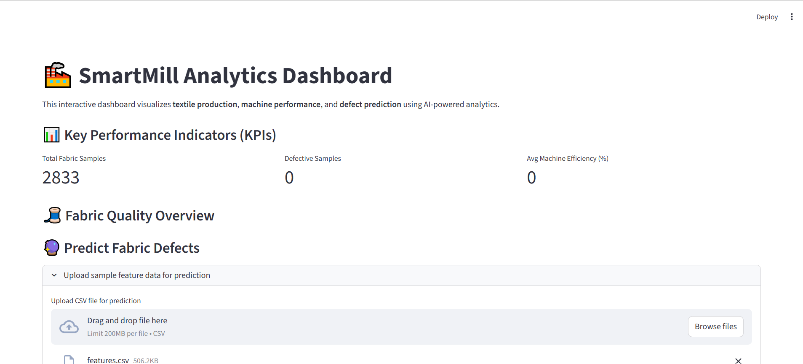
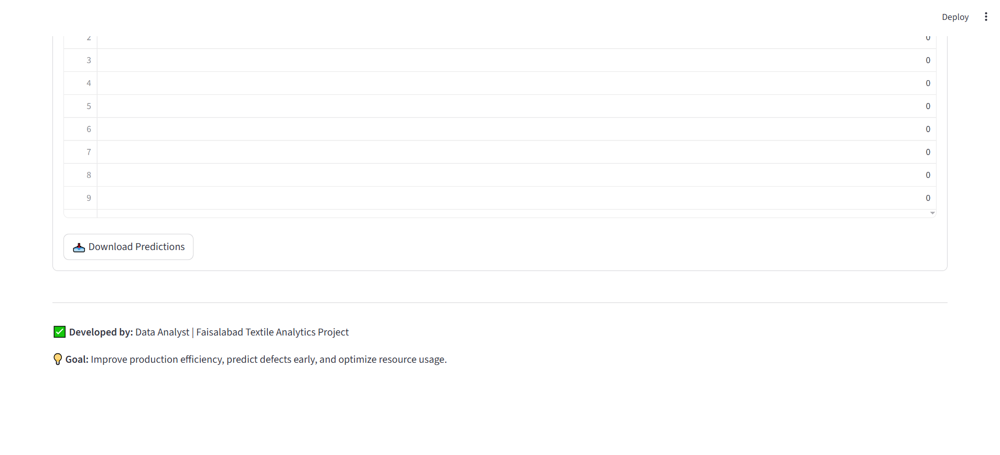
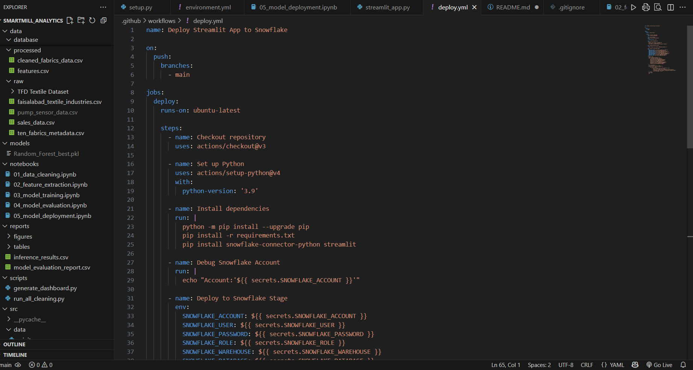

#  SmartMill Analytics – Textile Production Monitoring Dashboard

##  Project Overview
**SmartMill Analytics** is a data-driven **Streamlit dashboard** powered by **Snowflake** for advanced textile production monitoring and analytics.  
It helps factory managers and decision-makers track real-time metrics like yarn production, machine efficiency, wastage rates, and cost optimization.

This project demonstrates the use of **data warehousing (Snowflake)**, **data visualization (Streamlit)**, and **machine learning (Scikit-Learn)** to enable actionable insights in textile manufacturing.

---

##  Objectives
- To centralize production and operational data from different sources.
- To provide visual KPIs for better decision-making.
- To automate analytics workflows for textile mill efficiency.
- To experiment with machine learning for predicting production performance.

---

##  Tech Stack
| Category | Technology Used |
|-----------|----------------|
| **Frontend / Visualization** | Streamlit |
| **Database & Cloud Data Warehouse** | Snowflake |
| **Data Analysis / ML** | Python, Pandas, Scikit-Learn, Joblib |
| **Visualization Libraries** | Plotly, Matplotlib |
| **Environment Management** | Conda (environment.yml) |
| **Automation / CI-CD** | GitHub Actions |

---

##  Architecture Diagram

```text
          ┌────────────────────┐
          │    Data Sources     │
          │  (Excel / CSV / DB) │
          └─────────┬───────────┘
                    │
                    ▼
          ┌────────────────────┐
          │     Snowflake DB    │
          │  (SMARTMILL_DB)     │
          └─────────┬───────────┘
                    │
                    ▼
          ┌────────────────────┐
          │   Python + Streamlit│
          │   (Data Fetching +  │
          │   Visualization)    │
          └─────────┬───────────┘
                    │
                    ▼
          ┌────────────────────┐
          │     User Dashboard  │
          └────────────────────┘


---

##  Project Structure


SmartMill_Analytics/
│
├── .github/workflows
│ └── deploy.yml
|
├── data/
│ ├── raw/
│ ├── processed/
│
├── models/
│ └── Random_Forest_best.pkl
│
├── notebooks/
│ ├── 01_data_cleaning.ipynb
│ ├── 02_feature_extraction.ipynb
│ ├── 03_model_training.ipynb
│ ├── 04_model_evaluation.ipynb
│ ├── 05_model_deployment.ipynb
│
├── app/
│ └── streamlit_app.py
│
├── reports/
│ ├── model_evaluation_report.csv
│ └── inference_results.csv
│
├── src/
│ ├── data/
│ ├── models/
│ ├── visualization/
│
├── README.md
└── requirements.txt


---

##  Dashboard Preview

| App UI | Code |
|----------------------------|--------------------|
|  |  |  |

---

##  How to Run Locally

### Clone the Repository
```bash
git clone https://github.com/yourusername/SmartMill_Analytics.git
cd SmartMill_Analytics

 Install Dependencies
pip install -r requirements.txt

 Run the Dashboard
streamlit run streamlit_app.py


The dashboard will open in your browser at:
 http://localhost:8501

 Business Value for Textile Mills

Reduce Defect Rates: AI detects defective batches early.

Boost Efficiency: Continuous monitoring of machine performance.

Predictive Maintenance: Identify underperforming machines before breakdown.

Cost Optimization: Data-driven insights help reduce wastage and downtime.


